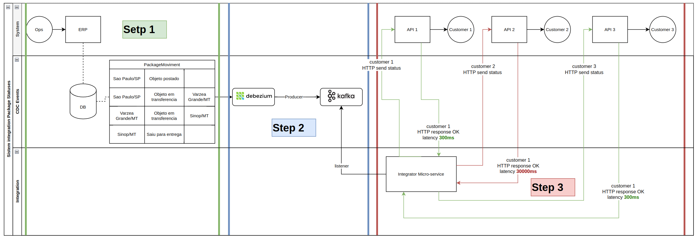
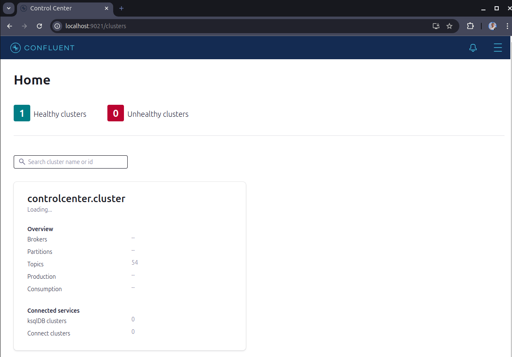
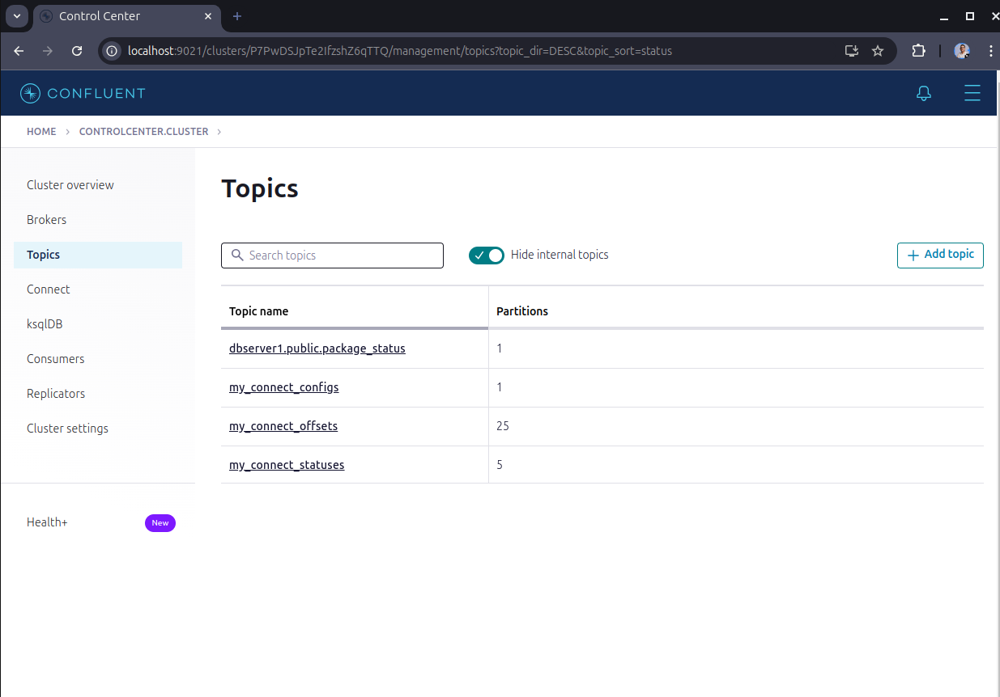
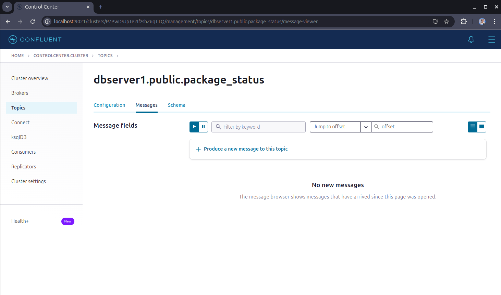
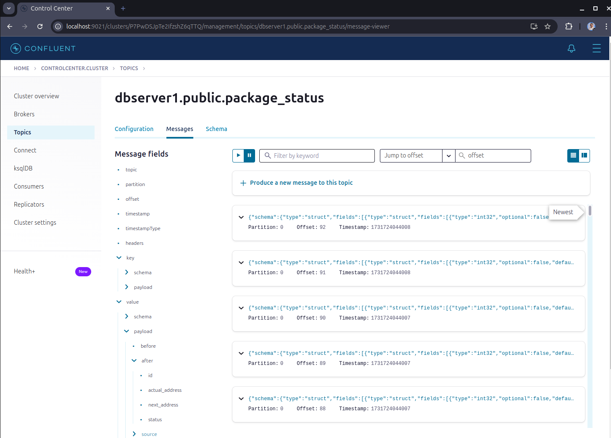

# Welcome to CDC (Change Database Capture) Events Producer 👋

  * [Architectural Design](#architectural-design)
  * [Description](#Description)
  * [Getting Started](#getting-started)
    + [Prerequisites](#prerequisites)
    + [Docker](#docker)
  * [Monitoring events](#monitoring-events)
  * [Generate data to insert rows ](#generate-data-to-insert-rows)
  * [Documentation](#documentation)
  * [Demonstration](#demonstration)


## Architectural Design

### Medium Article
This project is part of an article on Medium discussing the implementation of coroutines in Kotlin to solve performance latency issues. [You can read the full article here.]()

#### Solution Architecture

This project simulates the flow described in the Medium article, focusing on PART 1 and PART 2 of the architectural design:  

##### PART 1: Recording Movements in the Logistics ERP:  

* The operation records movements in the package_status table during the package's journey. The table contains the following columns:
  * actual_address
  * next_address
  * status (e.g., "Package Posted", "In Transit", "Package Delivered")

##### PART 2: Debezium and Kafka:
* Debezium is configured to monitor the package_status table and stream events to a Kafka topic package_moviment_topic.

##### PART 3: Integrator Microservice:
* The Integrator microservice, written in Kotlin, consumes messages from the package_moviment_topic in Kafka and sends status updates to customer APIs.
* Customer APIs have varying latencies, with Customer 1 and Customer 3 responding in about 300ms, while Customer 2 can take up to 30 seconds.

##### Relation to the Article
This project sets up the scenario for PART 1 and PART 2, creating a chaotic environment with multiple data transactions via CDC, moving statuses to the Integrator microservice. The next implementation will involve the Integrator microservice, written in Kotlin, to consume messages from the package_moviment_topic and send status updates to customer APIs.  By following this project, you can understand the initial setup and data flow, preparing for the subsequent implementation of the Integrator microservice as described in the Medium article.

## Description
Make a several data to store in postgresql database. \
Debezium capture data and produce events that will be send to the Kafka topic.

- **Postgresql**: Database to store data
- **Kafka**: Message broker to send events
- **Debezium**: Capture data from postgresql and produce events to Kafka
- **Kafka Connect**: Connect to Kafka and send events to Kafka topic
- **Kafka Painel**: Conflunt interface to Monitor events in Kafka topic

## Getting Started

### Prerequisites

- Docker / Docker Compose installed
- Python 3.7 or higher
- Define Debezium version -- preferred 2.7

```sh
export DEBEZIUM_VERSION=2.7
```

### Docker Containers

**Start Containers**
```sh
make up
```

**Start Containers with logs**
```sh
make up-logs
```

**Create Debezium Connector**
```sh
make create-connector
```

**Down Containers**
```sh
make down
```

## Generate Data to Insert Rows

After setup your docker containers and make sure that the Debezium connector is running \
you can generate data to insert rows in the database.

You need to have a Python environment configured to run the script. \
[You can use a virtual environment ](https://packaging.python.org/en/latest/guides/installing-using-pip-and-virtual-environments/#create-and-use-virtual-environments)

**Install Python Requirements**
```sh
make pip-install
```

**Run the Script to Generate Data**
```sh
python main.py -Q <quantity>
```
**Replace <quantity> with the number of fake data entries you want to generate. 
The default is 10 if not specified.**

## Monitoring Events
**Start Monitoring Change Data Stream**
```sh
make start-monitoring
```

## Documentation
Add diagrams and design docs related to this service to the docs folder.



Documentation about docker compose CDC, click [here](https://github.com/debezium/debezium-examples) \
Asyncpg client documentation, click [here](https://github.com/MagicStack/asyncpg)

## Demonstration
Accessing the Kafka Confluent Interface
### 1. Start the Kafka Confluent Interface: Ensure your Docker containers are running. If not, go back to the previous section and start the Docker containers.

### 2. Access the Kafka Confluent Interface: Open your web browser and navigate to the following URL: [http://localhost:9021](http://localhost:9021). If you not see the Kafka Confluent interface, wait a few minutes and refresh the page.



### 3. Navigate to the Topics Section: In the Kafka Confluent interface, go to the "Topics" section to view the list of Kafka topics.



### 4. Click on the "dbserver1.public.package_status" topic to view the messages produced by the Debezium connector.



### 5. Execute the Python script to generate data: Open a new terminal and run the Python script to generate data. The script will insert rows into the database, and the Debezium connector will capture the changes and produce events to the Kafka topic.
### 6. Monitor the Events: In the Kafka Confluent interface, navigate to the "Messages" section to monitor the events produced by the Debezium connector. You can see the events in the "Key" and "Value" columns.


